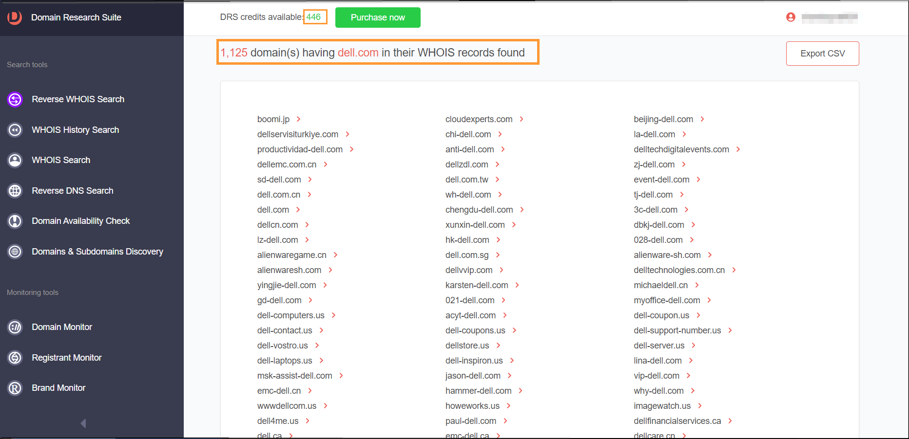

# Root Domain Enumeration

## Methods

### 1. WhoisXMLAPI

[https://tools.whoisxmlapi.com/reverse-whois-search](https://tools.whoisxmlapi.com/reverse-whois-search)

<mark style="background-color:red;">\[Reverse WHOIS]</mark> Searching with the root domain name like **dell.com** will give you a list of all the associated domains.

<figure><figcaption></figcaption></figure>


These are not 100% accurate results, as they contain false positives


### 2. Whoxy&#x20;

[https://www.whoxy.com](https://www.whoxy.com/)

<mark style="background-color:red;">\[Reverse WHOIS]</mark> To get related domains with the Company as : Dell Inc. {click this}

<figure><figcaption></figcaption></figure>

### 3. Crunchbase

[https://www.crunchbase.com](https://www.crunchbase.com/)

<mark style="background-color:red;">\[Acquisitions]</mark> Crunchbase is another great alternative for finding acquisitions but requires a paid subscription to view all the acquisitions. The trial version allows viewing some of the acquisitions.

<figure><figcaption></figcaption></figure>

### 4. ChatGPT

[https://chatgpt.com](https://chatgpt.com/)

<mark style="background-color:red;">\[Acquisitions]</mark> You can leverage OpenAI's ChatGPT for getting a list of acquisitions that are owned by a particular organization. Below is the example of getting acquisitions of Tesla

<figure><figcaption></figcaption></figure>

