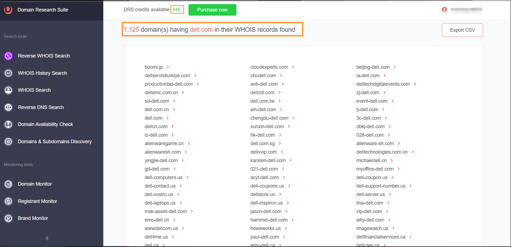

# Root Domain Enumeration

## Methods

### 1. WhoisXMLAPI

(reverse WHOIS) Visit [https://tools.whoisxmlapi.com/reverse-whois-search](https://tools.whoisxmlapi.com/reverse-whois-search) . Searching with the root domain name like **dell.com** will give you a list of all the associated domains.

<figure><figcaption></figcaption></figure>


These are not 100% accurate results, as they contain false positives


### 2. Whoxy [https://www.whoxy.com/](https://www.whoxy.com/)

(reverse WHOIS) To get related domains with the Company as : Dell Inc.

<figure><figcaption></figcaption></figure>

### 3. Crunchbase
